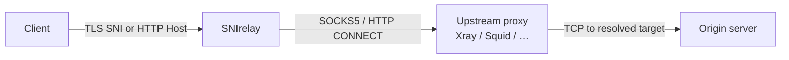

<h1 align="center">SNIrelay</h1>

<p align="center">
  <strong>High-performance TLS SNI &amp; HTTP transparent proxy — tunnel through SOCKS5 or HTTP CONNECT without terminating TLS.</strong>
</p>

<p align="center">
  <a href="LICENSE"></a>
  <a href="https://www.rust-lang.org"></a>
  
  
  
  <a href="https://hub.docker.com/r/alirezaramezanzadeh/snirelay"></a>
  <a href="https://hub.docker.com/r/alirezaramezanzadeh/snirelay"></a>
</p>

<p align="center">
  <a href="#features">Features</a> •
  <a href="#quick-start">Quick start</a> •
  <a href="#docker">Docker Hub</a> •
  <a href="#configuration">Configuration</a> •
  <a href="#observability">Observability</a> •
  <a href="#production">Production</a>
</p>

---

**SNIrelay** is a layer-4 reverse proxy that reads the **TLS SNI** hostname or **HTTP `Host`** header, matches against a **`hosts`** allowlist (with optional DNS overrides), and forwards **raw bytes** to the origin through an upstream **SOCKS5** or **HTTP CONNECT** proxy (Xray, v2ray, Dante, Squid, etc.).

It never decrypts TLS. Client certificates, ALPN, and HTTP/2 negotiation stay end-to-end between the client and the real server.

**Repository:** [github.com/Alireza-Ramezanzadeh/SNIrelay](https://github.com/Alireza-Ramezanzadeh/SNIrelay)  
**Docker Hub:** `docker.io/alirezaramezanzadeh/snirelay:0.2.2` ([Docker Hub](https://hub.docker.com/r/alirezaramezanzadeh/snirelay))  
**GitHub Packages:** `ghcr.io/alireza-ramezanzadeh/snirelay:0.2.2` ([GitHub Packages](https://github.com/Alireza-Ramezanzadeh/SNIrelay/pkgs/container/snirelay))

## Features

- **TLS passthrough** — Parse SNI from `ClientHello` only; replay the exact handshake bytes upstream
- **HTTP & HTTPS** — Multiple listeners (443, 80, 8080, custom ports) in one config file
- **Upstream tunneling** — SOCKS5 (with optional auth) or HTTP `CONNECT`; `direct` mode for testing
- **Hosts allowlist** — Sniproxy-style `table hosts`: which domains may relay + optional IP override
- **Built for heavy traffic** — Connection limits tied to `RLIMIT_NOFILE`, listen backlog, non-blocking metrics snapshots
- **Prometheus metrics** — Global and per-`client_ip` / `domain` / `upstream` breakdown
- **Grafana-ready** — Import [`grafana/dashboards/sniproxy-overview.json`](grafana/dashboards/sniproxy-overview.json)
- **Docker & host network** — Smart loopback remapping for bridge vs `--network host`
- **Per-domain daily limits** — Bandwidth and connection quotas by SNI/Host; persisted across restarts
- **Graceful shutdown** — SIGINT / SIGTERM stops listeners cleanly; limit counters flushed to disk

## How it works



## Quick start

### Docker (recommended)

Images are published to both **Docker Hub** and **GitHub Packages**. Use **host network** when the upstream proxy listens on `127.0.0.1` (typical Xray/v2ray setup):

```bash
# Docker Hub
docker pull alirezaramezanzadeh/snirelay:0.2.2

# GitHub Packages
docker pull ghcr.io/alireza-ramezanzadeh/snirelay:0.2.2

docker run --rm -it --network host \
  --ulimit nofile=1048576:1048576 \
  -v /path/to/config.yaml:/etc/sniproxy/config.yaml \
  -v snirelay-data:/var/lib/snirelay \
  -e PROXY="socks5 127.0.0.1 10808" \
  alirezaramezanzadeh/snirelay:0.2.2
```

### From source

```bash
# Rust 1.85+ required
cargo build --release
./target/release/snirelay --config config/config.yaml
```

Override upstream at runtime:

```bash
./target/release/snirelay \
  --config config/config.yaml \
  --proxy "socks5 127.0.0.1 10808"
```

## Docker Hub

Official image: **[`alirezaramezanzadeh/snirelay`](https://hub.docker.com/r/alirezaramezanzadeh/snirelay)**

| Tag | Image | Use |
|-----|--------|-----|
| **`0.2.2`** | `alirezaramezanzadeh/snirelay:0.2.2` | Pinned release (recommended for production) |
| **`latest`** | `alirezaramezanzadeh/snirelay:latest` | Same build as `0.2.2` after each release push |

### Pull and run

```bash
docker pull alirezaramezanzadeh/snirelay:0.2.2

docker run -d --restart always  --network host \
  --ulimit nofile=1048576:1048576 \
  -v $(pwd)/snirelay/snirelay.yaml:/etc/sniproxy/config.yaml \
  -v $(pwd)/snirelay:/var/lib/snirelay  \
  --name snirelay \
  alirezaramezanzadeh/snirelay:0.2.2
```

### Build and push (maintainers)

**GitHub Actions (recommended):** push a version tag and the workflow publishes images:

```bash
git tag v0.2.2
git push origin v0.2.2
```

This builds and pushes `ghcr.io/<owner>/snirelay:0.2.2` and `:latest`. For Docker Hub, add repository secrets `DOCKERHUB_USERNAME` and `DOCKERHUB_TOKEN` (see [`.github/workflows/release-docker.yml`](.github/workflows/release-docker.yml)).

**Manual push** (after `docker login`):

```bash
export VERSION=0.2.2
export IMAGE=alirezaramezanzadeh/snirelay
export GHCR=ghcr.io/alireza-ramezanzadeh/snirelay

docker build -t "${IMAGE}:${VERSION}" -t "${IMAGE}:latest" \
             -t "${GHCR}:${VERSION}" -t "${GHCR}:latest" .
docker push "${IMAGE}:${VERSION}" && docker push "${IMAGE}:latest"
docker push "${GHCR}:${VERSION}" && docker push "${GHCR}:latest"
```

The container runs the **`snirelay`** binary at `/usr/local/bin/snirelay`.

## Configuration

Example: [`config/config.yaml`](config/config.yaml)

| Section | Purpose |
|--------|---------|
| `upstream_proxy` | SOCKS5, HTTP CONNECT, or `direct` |
| `listens` | Bind addresses and `proto: tls \| http` |
| `hosts` | Allowlist (regex patterns) + DNS/IP (`address: "*"` = use client hostname) |
| `max_connections` | Concurrent sessions (capped from open-file limit) |
| `nofile_limit` | Raise `RLIMIT_NOFILE` at startup |
| `metrics_addr` | Prometheus scrape endpoint (e.g. `:9090`) |
| `metrics_refresh_secs` | Background `/metrics` snapshot interval |

**Hosts example:**

```yaml
listens:
  - name: public-https
    addr: "0.0.0.0:443"
    proto: tls

hosts:
  - pattern: ".*\\.example\\.com"
    address: "*"
  - pattern: "cdn.example.com"
    address: "203.0.113.10"
  # Allow all domains (open proxy):
  # - pattern: ".*"
  #   address: "*"
```

## Observability

### Prometheus

Scrape `:9090/metrics`. Metrics use the `sniproxy_*` prefix (unchanged for compatibility).

```yaml
scrape_configs:
  - job_name: snirelay
    static_configs:
      - targets: ["your-server:9090"]
        labels:
          service: snirelay
          environment: production
```

### Grafana

Import: [`grafana/dashboards/sniproxy-overview.json`](grafana/dashboards/sniproxy-overview.json)

The top row **Selected time range (totals)** shows bytes transferred (total, upload, download) and **sessions opened** over whatever period you pick in the time picker, using `increase(...[$__range])` on the `*_by_target_*` metrics so the **Domain** dropdown filters these panels (global `sniproxy_bytes_proxied_total` / `sniproxy_connections_total` have no domain label).

Regenerate the JSON after editing queries: `python3 grafana/gen_dashboard.py`.

## Production

**Open files** — raise per-process limit, not only `sysctl fs.file-max`:

```bash
ulimit -n 1048576

docker run -d --name snirelay --restart unless-stopped \
  --network host \
  --ulimit nofile=1048576:1048576 \
  -v /root/snirelay.yaml:/etc/sniproxy/config.yaml \
  -e PROXY="socks5 127.0.0.1 10808" \
  alirezaramezanzadeh/snirelay:0.2.2
```

**Upstream on localhost** — use `docker run --network host` or bind Xray to `0.0.0.0:10808`.

**Heavy traffic tuning:**

```yaml
nofile_limit: 1048576
max_connections: 50000
listen_backlog: 4096
metrics_refresh_secs: 2
```

## Comparison

| | **SNIrelay** | Classic sniproxy | nginx stream |
|--|--------------|------------------|--------------|
| TLS termination | No | No | Optional |
| SOCKS5 upstream | Yes | Via external tools | Limited |
| HTTP CONNECT upstream | Yes | Via external tools | No |
| Per-client Prometheus labels | Yes | No | Limited |
| Rust / single static binary | Yes | C | C |

## Project layout

```text
├── src/              # Proxy core
├── config/           # Example YAML
├── grafana/          # Dashboard + alerts
├── Dockerfile
└── docker-entrypoint.sh
```

## Contributing

See [CONTRIBUTING.md](CONTRIBUTING.md) for development setup, PR expectations, and how to regenerate the Grafana dashboard.

## License

[MIT](LICENSE)

---

<p align="center">
  If SNIrelay helps you, consider giving the repo a ⭐ on GitHub.
</p>
