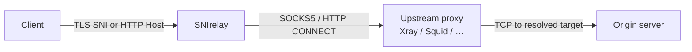

<h1 align="center">SNIrelay</h1>

<p align="center">
  <strong>High-performance TLS SNI &amp; HTTP transparent proxy for Rust — tunnel everything through SOCKS5 or HTTP CONNECT without terminating TLS.</strong>
</p>

<p align="center">
  <a href="LICENSE"></a>
  <a href="https://www.rust-lang.org"></a>
  
  
  
</p>

<p align="center">
  <a href="#features">Features</a> •
  <a href="#how-it-works">How it works</a> •
  <a href="#quick-start">Quick start</a> •
  <a href="#configuration">Configuration</a> •
  <a href="#observability">Observability</a> •
  <a href="#production">Production</a> •
  <a href="#comparison">Comparison</a>
</p>

---

**SNIrelay** (Rust crate: `pingora-sniproxy`) is a layer-4 reverse proxy that reads the **TLS SNI** hostname or **HTTP `Host`** header, routes traffic with regex rules and a static hosts table, and forwards **raw bytes** to the origin through an upstream **SOCKS5** or **HTTP CONNECT** proxy (Xray, v2ray, Dante, Squid, etc.).

It never decrypts TLS. Client certificates, ALPN, and HTTP/2 negotiation stay end-to-end between the client and the real server.

> **Why “SNIrelay”?** Short, searchable, and accurate: you *relay* connections based on *SNI*.  
> GitHub: [`Alireza-Ramezanzadeh/SNIrelay`](https://github.com/Alireza-Ramezanzadeh/SNIrelay)

## Features

- **TLS passthrough** — Parse SNI from `ClientHello` only; replay the exact handshake bytes upstream
- **HTTP & HTTPS** — Multiple listeners (443, 80, 8080, custom ports) in one config file
- **Upstream tunneling** — SOCKS5 (with optional auth) or HTTP `CONNECT`; `direct` mode for testing
- **Flexible routing** — Per-listener regex routes; static `hosts:` table for IP overrides (sniproxy-style)
- **Built for heavy traffic** — Connection limits tied to `RLIMIT_NOFILE`, listen backlog, non-blocking metrics snapshots
- **Prometheus metrics** — Global and per-`client_ip` / `domain` / `upstream` counters; scrape-safe under load
- **Grafana-ready** — Import [`grafana/dashboards/sniproxy-overview.json`](grafana/dashboards/sniproxy-overview.json)
- **Docker & host network** — Smart loopback remapping for bridge vs `--network host`
- **Graceful shutdown** — SIGINT / SIGTERM stops listeners cleanly

## How it works



1. Accept TCP on a configured listener (`tls` or `http`).
2. Peek the first bytes; extract **SNI** or **`Host`** (and port).
3. Apply **hosts table**, then **listener routes** (`target: "*"` = use client hostname).
4. Dial the origin **through** the upstream proxy.
5. **Splice** bytes both ways (zero TLS termination).

## Quick start

### Docker (recommended)

Use **host network** when the upstream proxy listens on `127.0.0.1` (typical Xray/v2ray setup):

```bash
docker build -t snirelay:latest .

docker run --rm -it --network host \
  --ulimit nofile=1048576:1048576 \
  -v "$(pwd)/config/config.yaml:/etc/sniproxy/config.yaml" \
  -e PROXY="socks5 127.0.0.1 10808" \
  snirelay:latest
```

### From source

```bash
# Rust 1.85+ required
cargo build --release
./target/release/pingora-sniproxy --config config/config.yaml
```

Override upstream at runtime:

```bash
./target/release/pingora-sniproxy \
  --config config/config.yaml \
  --proxy "socks5 127.0.0.1 10808"
```

## Configuration

Example: [`config/config.yaml`](config/config.yaml)

| Section | Purpose |
|--------|---------|
| `upstream_proxy` | SOCKS5, HTTP CONNECT, or `direct` |
| `listens` | Bind addresses, `proto: tls \| http`, per-listener `routes` |
| `hosts` | Static hostname → IP map (`address: "*"` = passthrough) |
| `max_connections` | Concurrent sessions (capped from open-file limit) |
| `nofile_limit` | Raise `RLIMIT_NOFILE` at startup |
| `metrics_addr` | Prometheus scrape endpoint (e.g. `:9090`) |
| `metrics_refresh_secs` | Background `/metrics` snapshot interval |

**Routing example** — send `internal.example.com` to a fixed backend; everything else uses the client SNI:

```yaml
listens:
  - name: public-https
    addr: "0.0.0.0:443"
    proto: tls
    routes:
      - pattern: "^internal\\.example\\.com$"
        target: "10.0.0.5:443"
      - pattern: ".*"
        target: "*"
```

**Hosts table** — override DNS for specific domains before routes run:

```yaml
hosts:
  - pattern: downloads.example.com
    address: 198.51.100.10
  - pattern: ".*"
    address: "*"
```

## Observability

### Prometheus

Scrape `:9090/metrics` (or your `metrics_addr`). Metrics are served from a **pre-encoded snapshot** so scrapes stay fast under heavy load.

| Metric | Type | Description |
|--------|------|-------------|
| `sniproxy_active_connections` | Gauge | Open proxy sessions |
| `sniproxy_connections_total` | Counter | Successful sessions |
| `sniproxy_connection_errors_total` | Counter | Failed sessions |
| `sniproxy_bytes_proxied_total` | Counter | Total bytes relayed |
| `sniproxy_accepted_connections_total` | Counter | TCP accepts (by `client_ip`) |
| `sniproxy_*_by_target_*` | Labeled | Per `client_ip`, `domain`, `upstream` |

Example `prometheus.yml`:

```yaml
scrape_configs:
  - job_name: snirelay
    static_configs:
      - targets: ["your-server:9090"]
        labels:
          service: snirelay
          environment: production
```

### Grafana

Import the dashboard:

```text
grafana/dashboards/sniproxy-overview.json
```

Optional provisioning: [`grafana/provisioning/dashboards/dashboards.yaml`](grafana/provisioning/dashboards/dashboards.yaml)

Regenerate after metric changes:

```bash
python3 grafana/gen_dashboard.py
```

## Production

**Open files** — `sysctl fs.file-max` is system-wide; each process needs a high **`ulimit -n`**:

```bash
ulimit -n 1048576
# Docker:
docker run --ulimit nofile=1048576:1048576 ...
```

**Upstream on localhost** — With Xray on `127.0.0.1:10808`, run SNIrelay with `--network host` or bind Xray to `0.0.0.0` when using bridge networking.

**Config tuning** for ~40–100+ Mbit/s and many concurrent clients:

```yaml
nofile_limit: 1048576
max_connections: 50000
listen_backlog: 4096
metrics_refresh_secs: 2
```

Startup logs show the effective connection cap:

```text
Process open-file soft limit: 1048576; max concurrent proxy sessions: 50000
```

## Comparison

| | **SNIrelay** | Classic sniproxy | nginx stream |
|--|--------------|------------------|--------------|
| TLS termination | No (passthrough) | No | Optional |
| SOCKS5 upstream | Yes | Via external tools | Limited |
| HTTP CONNECT upstream | Yes | Via external tools | No |
| Per-client Prometheus labels | Yes | No | Limited |
| Rust / single static binary | Yes | C | C |
| Heavy-load metrics | Snapshot scrape | N/A | Varies |

## Project layout

```text
├── src/              # Proxy core (SNI parse, splice, routing)
├── config/           # Example YAML
├── grafana/          # Dashboard + generator
├── Dockerfile
└── docker-entrypoint.sh
```

## Contributing

Issues and pull requests are welcome. Please include:

- What you changed and why
- How you tested (e.g. `cargo test`, Docker smoke test)

## License

[MIT](LICENSE) — use freely in commercial and personal projects.

---

<p align="center">
  If SNIrelay saves you time, consider giving the repo a ⭐ — it helps others find it.
</p>
